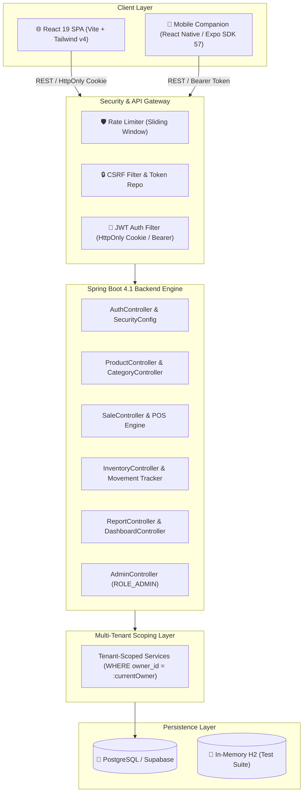

# 🏪 ShopManager

[](https://www.oracle.com/java/)
[](https://spring.io/projects/spring-boot)
[](https://react.dev/)
[](https://reactnative.dev/)
[](https://expo.dev/)
[](https://tailwindcss.com/)
[](https://supabase.com/)
[](https://expo.dev/artifacts/eas/9X_FWuEhV24ne1XBwBnaj9eguLNEl9YVLyhOai2lvuU.apk)

> A modern, multi-tenant retail management platform and native mobile POS companion designed for small-to-medium retail businesses (groceries, supermarkets, apparel, electronics, and general stores). Features real-time inventory management, customer credit ledger (Khata / Udhaar), high-speed point-of-sale billing with barcode scanning, business intelligence reports, and strict per-owner tenant isolation.

---

## 📑 Table of Contents

- [Key Capabilities](#-key-capabilities)
- [System Architecture](#-system-architecture)
- [Technology Stack](#-technology-stack)
- [Mobile Companion App & Android APK](#-mobile-companion-app-android--ios)
- [Project Structure](#-project-structure)
- [Quick Start Guide](#-quick-start-guide)
  - [Prerequisites](#prerequisites)
  - [Backend Setup](#1-backend-setup)
  - [Frontend Web Setup](#2-frontend-web-setup)
  - [Mobile App Setup](#3-mobile-app-setup)
- [API Reference](#-api-reference)
- [Multi-Tenant Data Isolation](#-multi-tenant-data-isolation)
- [Security Architecture](#-security-architecture)
- [Testing & Quality Assurance](#-testing--quality-assurance)
- [License](#-license)

---

## 🚀 Key Capabilities

### 🛒 Point-of-Sale (POS) & Smart Billing
- **High-Speed Multi-Item Checkout**: Atomic stock deduction and stock-level validation at checkout with instant total calculation.
- **Precision Quantity Stepper & Modal**: Fast preset increment chips (`+1`, `+5`, `+10`, `+25`, `0.25`, `0.5`, `1.0`), fine-grained decimal support for weighed items, inline card steppers, and interactive cart drawer editing.
- **Continuous Barcode Scanning (Mobile)**: Camera-based scanner with instant acoustic and haptic feedback for frictionless cashier operation.
- **Margin & Discount Intelligence**: Automatically computes profit per item/sale, tracking MRP vs. Selling Price discount savings.
- **Digital Invoices & WhatsApp Sharing**: Instant digital receipt generation, printable/PDF export, and 1-tap WhatsApp sharing to customer phone numbers.

### 📖 Customer Credit Ledger (Khata / Udhaar Book)
- **Customer Account Tracking**: Maintain customer profiles, active credit balances, and lifetime transaction records.
- **Direct Credit Sale Logging**: Route POS sales directly into customer credit ledgers with optional custom notes.
- **Settlement & Repayments**: Record partial or full cash settlements with automatic debt recalculation and timestamps.
- **1-Tap WhatsApp Payment Reminders**: Generate personalized payment reminder messages pre-filled with outstanding debt balance and shop details.

### 📦 Inventory & Stock Management
- **Product Catalog**: Manage SKU, barcode, brand, category, unit of measure (`PCS`, `KG`, `G`, `L`, `ML`, `BOX`, `PACK`, `DOZEN`), cost price, selling price, MRP, current stock, and min-stock threshold.
- **Dynamic Stock Status**: Automatic real-time status badges (`IN_STOCK`, `LOW_STOCK`, `OUT_OF_STOCK`).
- **Batch Stock-In & Adjustments**: Receive fresh inventory shipments or log adjustments (damage, loss, expired, correction) with audit notes.
- **Immutable Movement History**: Comprehensive movement ledger tracking quantity shifts, before/after levels, reference numbers, and reason codes.
- **Soft Deletes**: Product archival and restoration preserving historical sales data integrity.

### 📊 Real-Time Analytics & Business Intelligence
- **Live Dashboard**: Real-time KPI summary widgets displaying Today's Revenue, Net Profit, Sale Count, Low Stock count, Top Selling Products, and Recent Invoices.
- **Visual Revenue Trends**: Interactive SVG trend charts for revenue visualization.
- **Date-Range Reports**: Filter revenue, profit margins, sales count, and per-category breakdown across customizable timeframes (Today, 7 Days, 30 Days, or custom date ranges).

### 🏢 Multi-Tenant Architecture & Admin Governance
- **Strict Data Isolation**: Automatic `owner_id` tenancy scoping across all database queries, preventing cross-shop data leaks.
- **Role-Based Access Control (`USER` / `ADMIN`)**:
  - Dedicated Admin Panel for managing shop owners (view, edit status/role, soft-delete).
  - Platform-wide operational analytics for system administrators.
  - Automatic first-user admin bootstrapping or environment-based seeding.

---

## 🏛️ System Architecture



---

## 💻 Technology Stack

| Layer | Technologies | Version | Details |
|---|---|---|---|
| **Backend Framework** | Java, Spring Boot | Java 21, Spring Boot 4.1.0 | RESTful API, Spring Security, Spring Data JPA, Bean Validation |
| **Security & Auth** | JJWT, BCrypt | JJWT 0.12.6 | HttpOnly cookie sessions, Bearer fallback, sliding-window rate limiter |
| **Database & ORM** | PostgreSQL, Hibernate | PostgreSQL 16+ (Supabase) | HikariCP connection pooling, DDL auto-update |
| **Web Frontend** | React, Vite, React Router | React 19.2, Vite 8.2, RR v7.18 | SPA, Tailwind CSS v4, in-memory GET cache with deduplication |
| **Mobile Companion** | React Native, Expo | Expo SDK 57, RN 0.86, NativeWind | Camera barcode scanner, thermal/PDF receipts, EAS OTA updates |
| **Testing** | JUnit 5, Mockito, H2 | H2 Database (PostgreSQL mode) | 80+ backend unit/integration tests with zero live DB dependency |

---

## 📱 Mobile Companion App (Android & iOS)

ShopManager includes a native companion app built with **React Native** and **Expo SDK 57**, optimized for fast on-the-floor retail operations:

- **Instant POS Barcode Billing**: Continuous camera scanning with haptics & audio beeps.
- **Customer Khata Book**: Customer credit accounts, payment settlements, and WhatsApp reminders.
- **Thermal & PDF Receipts**: In-app itemized PDF generator with shop header/footer customization.
- **Over-The-Air (OTA) Updates**: Update mobile features and fixes in seconds without re-installing APKs.
- **0ms Instant Navigation**: Lazy-stacked screen caching with Stale-While-Revalidate memory data sync.

### 📲 Download Latest Android APK

| Resource | Link / Information |
|---|---|
| **Direct APK Download** | [📥 Download ShopManager Android APK](https://expo.dev/artifacts/eas/9X_FWuEhV24ne1XBwBnaj9eguLNEl9YVLyhOai2lvuU.apk) |
| **EAS Build Dashboard** | [Expo Build Artifacts Dashboard](https://expo.dev/accounts/anmolxtiwari/projects/shopmanager/builds) |
| **Latest Build Artifact ID** | `a7904734-7485-4685-a3f5-fde2f6a0de41` |

---

## 📂 Project Structure

```
ShopManager/
├── backend/                       # Spring Boot 4.1 REST API
│   ├── src/main/java/com/shopmanager/
│   │   ├── config/                # SecurityConfig, AdminBootstrap, WebMvcConfig
│   │   ├── controller/            # REST endpoints (Auth, Products, Sales, Debts, ...)
│   │   ├── dto/                   # Request/Response records grouped per module
│   │   ├── entity/                # JPA entities (User, Product, Category, Sale, StockMovement)
│   │   ├── exception/             # GlobalExceptionHandler, typed ApiError schema
│   │   ├── repository/            # Spring Data JPA repositories with owner scoping
│   │   ├── security/              # JwtAuthFilter, RateLimiter, CookieUtils
│   │   └── service/               # Tenant-isolated business logic layer
│   └── src/test/                  # 80+ unit and integration test suite
│
├── frontend/                      # React 19 SPA (Vite + Tailwind v4)
│   ├── src/
│   │   ├── components/            # Layout, ProtectedRoute, AdminRoute, RevenueChart, Icons
│   │   ├── pages/                 # Dashboard, POS, Sales, Debts, Inventory, Products, Reports, Admin
│   │   ├── services/              # API client (CSRF auto-retry, cache), Debts, Products, Sales
│   │   └── utils/                 # Formatting helpers, currency, date formatters
│   └── vercel.json                # Single-Page-App routing & production API proxy rules
│
├── mobile/                        # React Native & Expo Companion Application
│   ├── src/
│   │   ├── screens/               # POS, Scanner, Customer Debts, Inventory, Reports, Settings
│   │   ├── components/            # Quantity modals, custom numpads, receipt previews
│   │   └── services/              # Mobile API client, offline sync, PDF printing
│   ├── app.json                   # Expo application configuration & permissions
│   └── eas.json                   # Expo Application Services (EAS) build profiles
│
└── README.md                      # Project documentation
```

---

## 🏁 Quick Start Guide

### Prerequisites
- **Java**: OpenJDK 21 or newer
- **Node.js**: Node 20.x or newer & npm
- **Database**: PostgreSQL database (Local or Supabase)
- **Mobile (Optional)**: Expo Go app on iOS/Android or Expo CLI (`npm i -g expo-cli eas-cli`)

---

### 1. Backend Setup

1. Navigate to `backend/` and create an environment file `.env`:
   ```properties
   DB_URL=jdbc:postgresql://<host>:5432/postgres
   DB_USERNAME=<your_db_user>
   DB_PASSWORD=<your_db_password>
   JWT_SECRET=superSecretKeyForShopManagerMustBeAtLeast32CharsLong!
   ```

   **Optional Backend Environment Variables:**
   ```properties
   PORT=8081                            # Server port (default: 8081)
   JWT_EXPIRATION=86400000              # Token validity in ms (default: 24 hours)
   COOKIE_SECURE=false                  # Set true behind HTTPS (adds Secure + SameSite=None)
   FRONTEND_URL=http://localhost:5173   # Allowed CORS origin
   ADMIN_USERNAME=admin                 # Optional predefined admin bootstrap username
   ADMIN_PASSWORD=adminPassword123      # Optional predefined admin bootstrap password
   ADMIN_EMAIL=admin@shopmanager.com
   ```

2. Run the Spring Boot application:
   ```bash
   cd backend
   # Windows
   .\mvnw.cmd spring-boot:run

   # Linux / macOS
   ./mvnw spring-boot:run
   ```
   *Database tables will automatically be created/updated via Hibernate (`ddl-auto=update`).*

---

### 2. Frontend Web Setup

1. Open a new terminal and install dependencies:
   ```bash
   cd frontend
   npm install
   ```

2. Start the Vite development server:
   ```bash
   npm run dev
   ```
3. Visit **`http://localhost:5173`** in your browser. Register your first shop owner account!

---

### 3. Mobile App Setup

1. Open a new terminal in the `mobile/` directory:
   ```bash
   cd mobile
   npm install
   ```

2. Start the Expo development server:
   ```bash
   npx expo start
   ```

3. Scan the terminal QR code with **Expo Go** (Android/iOS) to run the companion app live on your phone.

#### Building Standalone Android APK
```bash
cd mobile
npx eas-cli build -p android --profile preview
```

#### Pushing Instant Over-The-Air (OTA) Updates
```bash
cd mobile
npx eas-cli update --branch preview --message "Feature update"
```

---

## 🔌 API Reference

**Base URL**: `http://localhost:8081/api` (proxied automatically in development)

### Authentication & Public Routes
| Method | Endpoint | Description | Access |
|---|---|---|---|
| `GET` | `/api/health` | Service health status check | Public |
| `GET` | `/api/auth/csrf` | Fetch CSRF token for state-changing operations | Public |
| `POST` | `/api/auth/register` | Register new shop owner account | Public (Rate limited) |
| `POST` | `/api/auth/login` | Login with username/email & password (sets HttpOnly cookie) | Public (Rate limited) |
| `POST` | `/api/auth/logout` | Clear session cookie and invalidate credentials | Public |
| `GET` | `/api/auth/me` | Fetch authenticated shop owner profile | Authenticated |

### Business & Inventory Operations
| Method | Endpoint | Description | Access |
|---|---|---|---|
| `GET` | `/api/dashboard/summary` | Today's revenue, profit, low stock count, top products | Authenticated |
| `GET` | `/api/categories` | List owner's product categories | Authenticated |
| `POST` | `/api/categories` | Create a new product category | Authenticated |
| `GET` | `/api/products` | List all active/archived products with search & filters | Authenticated |
| `POST` | `/api/products` | Create a new product | Authenticated |
| `GET` | `/api/products/{id}` | Get product details by ID | Authenticated |
| `PUT` | `/api/products/{id}` | Update product information | Authenticated |
| `DELETE` | `/api/products/{id}` | Soft-delete / archive product | Authenticated |
| `GET` | `/api/products/popular` | Retrieve top-selling products | Authenticated |
| `POST` | `/api/inventory/stock-in` | Record batch stock addition | Authenticated |
| `POST` | `/api/inventory/adjustment` | Record damage/expired/loss stock adjustment | Authenticated |
| `GET` | `/api/inventory/movements` | Query immutable stock movement ledger | Authenticated |
| `GET` | `/api/sales` | List past sales transactions with pagination | Authenticated |
| `POST` | `/api/sales` | Checkout a new multi-item sale (atomic stock deduction) | Authenticated |
| `GET` | `/api/sales/{id}` | Get full itemized invoice details | Authenticated |
| `GET` | `/api/reports/summary` | Date-range financial summaries (`?from=...&to=...`) | Authenticated |
| `POST` | `/api/settings/password` | Change account password | Authenticated (Rate limited) |
| `POST` | `/api/settings/email` | Update account email address | Authenticated |

### Administration & Platform Governance
| Method | Endpoint | Description | Access |
|---|---|---|---|
| `GET` | `/api/admin/users` | List all registered shop owners and tenant stats | `ROLE_ADMIN` |
| `POST` | `/api/admin/users` | Create user directly from administration | `ROLE_ADMIN` |
| `PATCH` | `/api/admin/users/{id}` | Update user role (`USER`/`ADMIN`) or status | `ROLE_ADMIN` |
| `DELETE` | `/api/admin/users/{id}` | Soft-delete/deactivate shop owner account | `ROLE_ADMIN` |
| `GET` | `/api/admin/analytics` | Platform-wide revenue, user counts & activity KPIs | `ROLE_ADMIN` |

---

## 🛡️ Multi-Tenant Data Isolation

ShopManager uses a **shared database, discriminator column** multi-tenant isolation strategy:
1. **Ownership Column**: Every domain entity table (`categories`, `products`, `sales`, `sale_items`, `stock_movements`) contains an indexed `owner_id` foreign key referencing the `users` table.
2. **Security Context Scoping**: Each HTTP request is authenticated via `JwtAuthFilter`. The authenticated `ownerId` is extracted directly from the verified JWT claims.
3. **Repository Enforced Boundaries**: Service methods explicitly constrain all queries by the authenticated user's ID (e.g. `findAllByOwnerIdAndActiveTrue`).
4. **Zero Cross-Tenant Leakage**: Attempting to query or modify an entity belonging to another shop owner returns a strict `404 Not Found` or `403 Forbidden`.

---

## 🔒 Security Architecture

- **Stateless HttpOnly Cookie Sessions**: JWTs are transferred via `HttpOnly` cookies (`access_token`) preventing XSS token theft. In production (`COOKIE_SECURE=true`), cookies are set with `SameSite=None` and `Secure`.
- **Bearer Token Support**: Mobile and external clients can authenticate via the standard `Authorization: Bearer <token>` header.
- **CSRF Defense**: State-changing endpoints are protected via Spring's `CookieCsrfTokenRepository` (`X-XSRF-TOKEN`). The frontend automatically seeds tokens and retries on token refresh.
- **Sliding-Window Rate Limiting**: Built-in sliding-window limiter prevents brute-force attacks on sensitive endpoints:
  - Login: 5 attempts per 15 minutes (keyed by username + IP).
  - Registration: 5 attempts per 15 minutes (keyed by IP).
  - Password Reset: 5 attempts per 15 minutes (keyed by user).
- **Strong Hashing & Validation**: Passwords are encrypted with BCrypt (`strength = 10`), and all payloads are validated with Bean Validation (`@Valid`, `@NotNull`, `@Size`, `@DecimalMin`).

---

## 🧪 Testing & Quality Assurance

### Backend Test Suite
The backend contains **82 unit and integration tests** across 15 test suites running against an in-memory **H2 database in PostgreSQL compatibility mode** (no live database required):

```bash
cd backend
# Windows
.\mvnw.cmd test

# Linux / macOS
./mvnw test
```

### Frontend Code Quality
```bash
cd frontend
npm run lint      # High-performance Oxlint rules
npm run build     # Production asset bundle verification
```

---

## 📄 License

This repository is a proprietary commercial project — All rights reserved.
